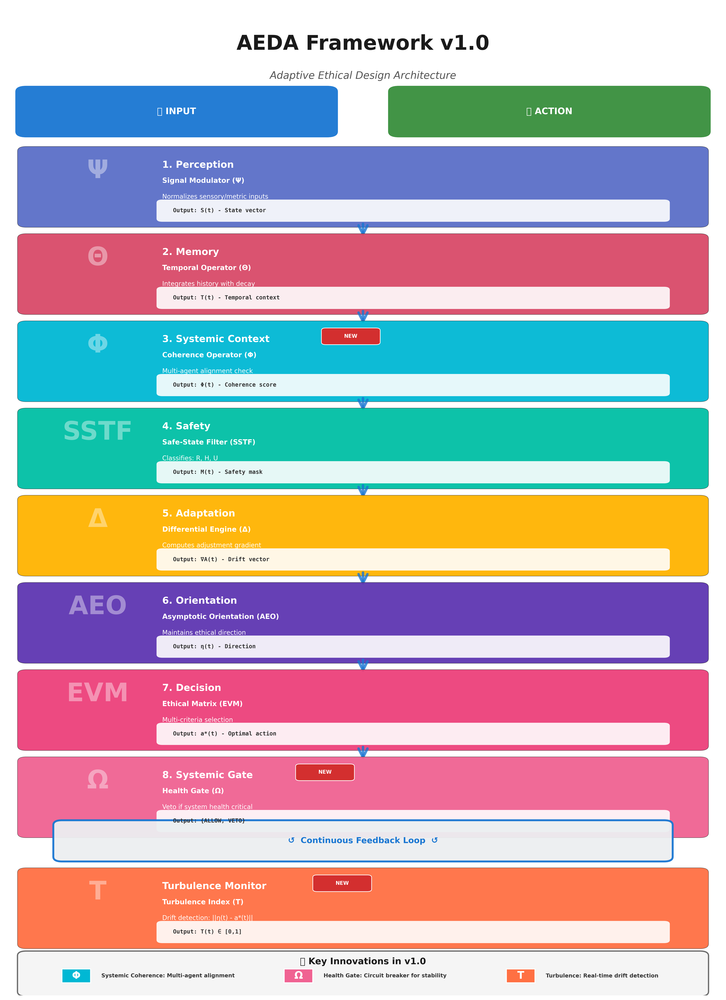

# GUIDE D'UPLOAD GITHUB - AEDA v1.0

## 📦 FICHIERS PRÊTS POUR UPLOAD

Tous les fichiers sont dans `/mnt/user-data/outputs/` :

### **Fichiers essentiels (à uploader en priorité) :**

1. ✅ **README.md** - Page d'accueil GitHub complète
2. ✅ **LICENSE** - CC0 domaine public
3. ✅ **AEDA_Manual_v1.0_English.pdf** - Manuel complet (converti)
4. ✅ **EXECUTIVE_SUMMARY.md** - Résumé 2 pages
5. ✅ **AEDA_Architecture_v1.0.png** - Infographie architecture
6. ✅ **AEDA_Architecture_v1.0.html** - Version interactive

### **Fichiers complémentaires (optionnels pour v1.0) :**

7. ⚪ **GITHUB_SETUP_GUIDE.md** - Guide configuration (pour votre usage, pas à publier)
8. ⚪ **POST_TEMPLATES.md** - Templates forums (pour votre usage)

---

## 🚀 ÉTAPES D'UPLOAD SUR GITHUB

### **Étape 1 : Créer le repository**

Vous avez déjà créé le repo "AEDA-Framework" ✅

### **Étape 2 : Configuration du repository**

#### **A. Configurer les Topics (tags)**

Sur la page principale de votre repo GitHub :

1. Cliquez sur l'icône ⚙️ à côté de "About" (en haut à droite)
2. Dans le champ "Topics", ajoutez ces tags :
   ```
   ai-safety
   ai-alignment
   ethics
   agi
   machine-learning
   ethical-ai
   artificial-intelligence
   alignment-research
   ```
3. Cliquez "Save changes"

**Pourquoi c'est important ?** Ces topics rendent votre repo découvrable par recherche GitHub.

#### **B. Configurer la Description**

Dans la même section "About" :

**Description :**
```
An 8-layer modular framework for systemic AI alignment with asymptotic ethical orientation
```

**Website (optionnel) :**
```
(laisser vide pour l'instant)
```

#### **C. Activer GitHub Discussions**

1. Allez dans **Settings** (onglet en haut)
2. Scroll down jusqu'à "Features"
3. ✅ Cochez "Discussions"
4. Cliquez "Set up discussions"
5. GitHub créera automatiquement les catégories de base

**Catégories recommandées à créer :**
- 💡 Ideas (nouvelles features, améliorations)
- ❓ Q&A (questions techniques)
- 📢 Show and Tell (implémentations des utilisateurs)
- 🔬 Research (discussions théoriques)

---

### **Étape 3 : Upload des fichiers**

#### **Option A : Via l'interface web GitHub (recommandé pour débutants)**

1. Sur la page de votre repo, cliquez **"Add file"** → **"Upload files"**

2. Glissez-déposez ces fichiers **dans cet ordre** :
   ```
   1. LICENSE
   2. README.md
   3. AEDA_Manual_v1.0_English.pdf
   4. EXECUTIVE_SUMMARY.md
   5. AEDA_Architecture_v1.0.png
   ```

3. Dans "Commit message", écrivez :
   ```
   Initial release: AEDA v1.0 - 8-layer framework for systemic AI alignment
   ```

4. Cliquez **"Commit changes"**

5. Pour les fichiers supplémentaires (html, etc.), répétez l'opération

#### **Option B : Via Git en ligne de commande (si vous êtes à l'aise)**

```bash
# 1. Cloner votre repo (si pas déjà fait)
git clone https://github.com/[VOTRE-USERNAME]/AEDA-Framework.git
cd AEDA-Framework

# 2. Copier les fichiers
cp /mnt/user-data/outputs/README.md .
cp /mnt/user-data/outputs/LICENSE .
cp /mnt/user-data/outputs/AEDA_Manual_v1.0_English.pdf .
cp /mnt/user-data/outputs/EXECUTIVE_SUMMARY.md .
cp /mnt/user-data/outputs/AEDA_Architecture_v1.0.png .

# 3. Créer un dossier docs (optionnel)
mkdir -p docs
cp /mnt/user-data/outputs/AEDA_Architecture_v1.0.html docs/

# 4. Configurer git (anonyme)
git config user.name "AEDA Collective"
git config user.email "aeda.framework@proton.me"

# 5. Commit et push
git add .
git commit -m "Initial release: AEDA v1.0 - 8-layer framework for systemic AI alignment"
git push origin main
```

---

### **Étape 4 : Personnaliser le README**

Le README.md contient un placeholder `[YOUR-USERNAME]`. Remplacez-le par votre nom d'utilisateur GitHub.

**Cherchez ces lignes dans README.md :**
```markdown
[](https://github.com/[YOUR-USERNAME]/AEDA-Framework)
```

**Remplacez par :**
```markdown
[](https://github.com/VOTRE-USERNAME/AEDA-Framework)
```

**Méthode rapide (via GitHub web) :**
1. Cliquez sur **README.md** dans votre repo
2. Cliquez sur l'icône ✏️ (Edit)
3. Faites Ctrl+F (ou Cmd+F) et cherchez `[YOUR-USERNAME]`
4. Remplacez partout par votre username
5. Commit changes

---

### **Étape 5 : Ajouter l'infographie au README**

Pour que l'image s'affiche dans le README :

1. Éditez **README.md** (icône ✏️)
2. Juste après la ligne `## 🏗️ Architecture: The 8 Layers`, ajoutez :

```markdown

```

3. Commit changes

**Résultat :** L'infographie s'affichera directement dans votre README !

---

### **Étape 6 : Créer un premier Issue (optionnel mais recommandé)**

Cela montre que le projet est actif et accueille les contributions.

1. Allez dans l'onglet **Issues**
2. Cliquez **"New issue"**
3. Titre : `Welcome & Roadmap - AEDA v1.0`
4. Description :

```markdown
## Welcome to AEDA v1.0! 🎉

This is the first public release of the Adaptive Ethical Design Architecture framework.

### What's in v1.0:
- ✅ 8-layer modular architecture
- ✅ Systemic Coherence Operator (Φ)
- ✅ Systemic Health Gate (Ω)
- ✅ Turbulence Index for drift detection (T)
- ✅ Complete Python reference implementation
- ✅ Detailed case studies

### Roadmap:

**Phase 1 (Current):**
- [ ] Academic paper submission (arXiv)
- [ ] Security audit of SSTF and Ω
- [ ] Performance benchmarks

**Phase 2 (Q1 2026):**
- [ ] Integration with PyTorch/TensorFlow
- [ ] Domain-specific adaptations
- [ ] Real-world pilot implementations

**Phase 3 (Q2+ 2026):**
- [ ] Visualization tools for Φ, Ω, T
- [ ] Educational materials
- [ ] Community-driven improvements

### How to contribute:
All contributions welcome - anonymous or attributed. See [CONTRIBUTING.md](CONTRIBUTING.md) for guidelines.

Ideas matter. Identity is optional.
```

5. Cliquez **"Submit new issue"**
6. **Épinglez cet issue** (icône 📌 à droite) pour qu'il reste en haut

---

### **Étape 7 : Configuration des permissions (important pour anonymat)**

1. **Settings** → **General**
2. Scroll jusqu'à "Pull Requests"
3. ✅ Cochez "Allow squash merging" (combine tous les commits en un)
4. ✅ Cochez "Automatically delete head branches" (nettoie après merge)

---

## 🎯 RÉSULTAT ATTENDU

Une fois tout uploadé, votre repo devrait avoir cette structure :

```
AEDA-Framework/
├── README.md                           (avec infographie visible)
├── LICENSE                             (CC0 domaine public)
├── AEDA_Manual_v1.0_English.pdf       (manuel complet)
├── EXECUTIVE_SUMMARY.md                (résumé 2 pages)
├── AEDA_Architecture_v1.0.png         (infographie PNG)
└── docs/
    └── AEDA_Architecture_v1.0.html    (version interactive)
```

**Page d'accueil :**
- Badge de version visible
- Description claire
- Topics configurés
- Infographie architecture
- Sections README bien formatées
- Liens vers manuel PDF et summary

---

## 📋 CHECKLIST POST-UPLOAD

Vérifiez que tout est OK :

- [ ] README s'affiche correctement (avec image)
- [ ] PDF du manuel s'ouvre sans problème
- [ ] LICENSE est bien CC0
- [ ] Topics sont configurés (ai-safety, ai-alignment, etc.)
- [ ] Discussions sont activées
- [ ] Premier issue "Welcome & Roadmap" est créé et épinglé
- [ ] Aucune information personnelle visible dans les commits
- [ ] Git config est bien anonyme (vérifier dans commits)

**Comment vérifier l'anonymat des commits :**
1. Cliquez sur "X commits" en haut du repo
2. Vérifiez que l'auteur est "AEDA Collective" (ou votre pseudo anonyme)
3. Si vous voyez votre vrai nom → problème de git config

---

## 🚨 EN CAS DE PROBLÈME

### **Erreur : Git config exposé (vrai nom visible)**

**Solution :**
```bash
# Dans votre terminal local
cd AEDA-Framework
git config user.name "AEDA Collective"
git config user.email "aeda.framework@proton.me"

# Modifier le dernier commit
git commit --amend --reset-author --no-edit
git push --force origin main
```

### **Image ne s'affiche pas dans README**

**Solution :**
1. Vérifiez que le fichier `AEDA_Architecture_v1.0.png` est bien à la racine
2. La ligne dans README doit être exactement : ``
3. Pas d'espace, respect de la casse

### **PDF ne s'affiche pas**

C'est normal ! GitHub ne preview pas les PDF directement. Les utilisateurs doivent cliquer dessus puis "Download" ou "View raw" pour l'ouvrir.

---

## 🎉 C'EST PRÊT !

Une fois ces étapes complétées, votre repo AEDA v1.0 est **prêt pour le lancement public**.

**Prochaine étape :** Posts sur LessWrong, Reddit, Hacker News (voir POST_TEMPLATES.md)

---

**Note finale :** Prenez le temps de relire le README sur GitHub après upload. C'est la première impression que les visiteurs auront. Assurez-vous que :
- Tout s'affiche correctement
- L'infographie est visible
- Les liens fonctionnent
- Le ton est professionnel mais accueillant

**Bon courage ! Vous êtes à quelques clics de changer le paysage de l'AI Safety. 🚀**
